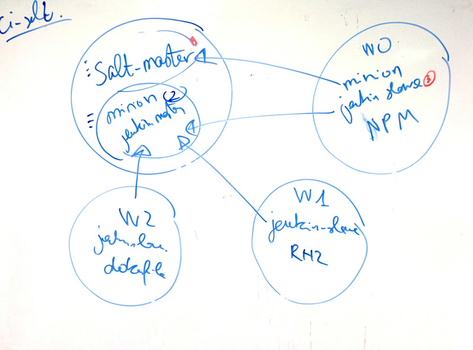

=======================
 Jenkins provisionning
=======================

Target system is debian wheezy.

Develop masterless
==================

As super user:

.. code-block:: console

   ./bootstrap.sh
   make develop-masterless
   salt-call state.highstate

Jenkins is available at port 80: `<http://localhost/>`_

Develop in master-minion mode
=============================

On the minion:

.. code-block:: console

   ./bootstrap.sh
   make install-minion

On the master:

.. code-block:: console

   ./bootstrap.sh
   make install-master

Connect your minions and master together. Note that your master is also a
minion: `<http://docs.saltstack.com/en/latest/ref/configuration/minion.html#configuring-the-salt-minion>`_

Go back to your master and run:

.. code-block:: console

  salt '*' state.highstate
